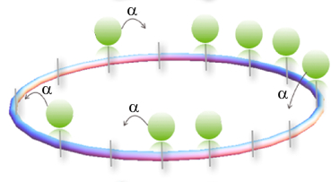
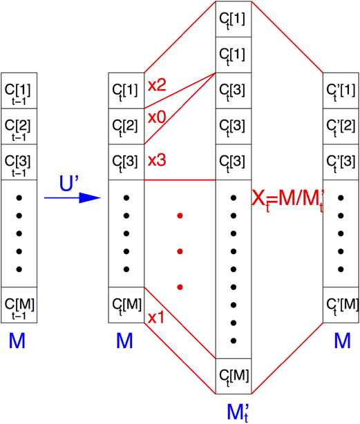

# Discrete Time Marchov Chain Simulation for Large Deviations in TASEP transport model

In this code, I provide the method first proposed by [Giardinà, Kurchan, and Peliti](https://doi.org/10.1103/PhysRevLett.96.120603) for simulating cumulant generating functions in discrete time Markov chains for The Totally Asymmetric Exclusion Process.

The Totally Asymmetric Exclusion Process is defined on a 1D lattice subject to periodic boundary conditions. Particles jump stochastically to a right empty nearest neighbor at a rate:

k(x) = 1 + (eα)/N × [number of particles in x with a free site to their right]

The population dynamics can be implemented using a diffusion Monte Carlo algorithm.

1. Each agent evolves according to the biased dynamic,
2. Each agent in configuration x is replicated/killed with an average rate proportional to k(x) , i.e. is replaced by G copies, where
	* G = ⌊k⌋ + 1 ; with probability k - ⌊k⌋
	* G = ⌊k⌋ ; with probability 1 - (k - ⌊k⌋)

*Note that the agent is replaced by G copies of itself; aka, the population size is increased by G − 1 (decreased by 1 if G = 0).*

3. After the cloning step, the population is rescaled to its initial size by randomly resampling agents.

The usecase and results, alongside the analytical solutions (for small systems with few possible configuratoins) for comparison and validation's sake are provided in the notebook.
